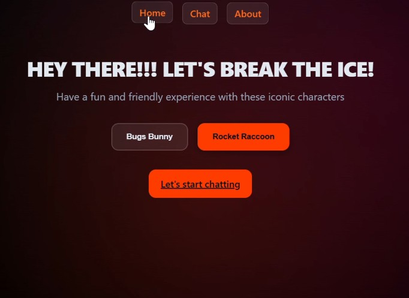
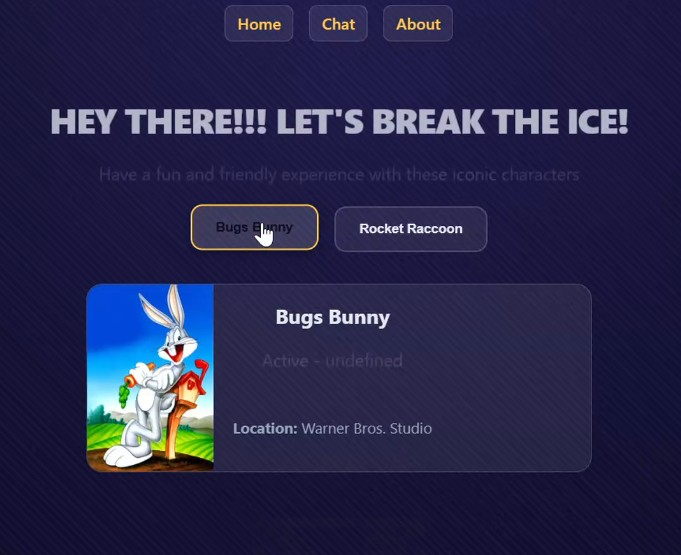
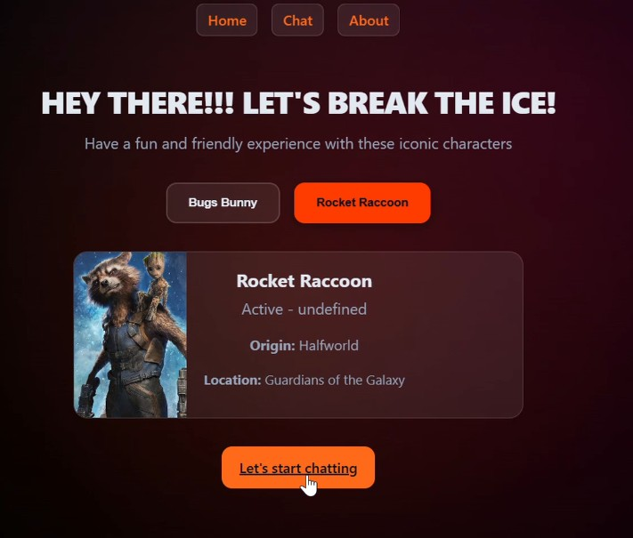
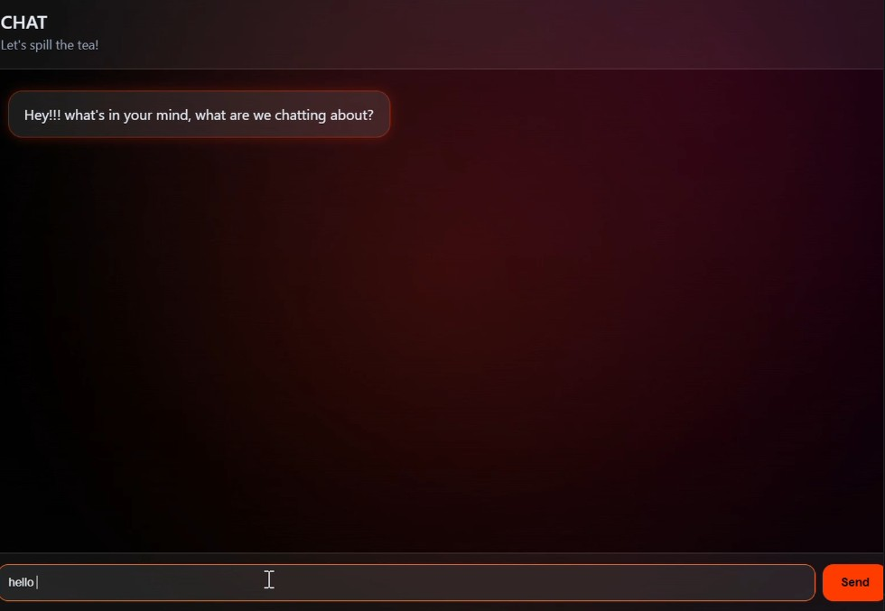

# 🎬 Character Chat SPA

An interactive Single Page Application where users chat with AI‑powered iconic characters. Built with Vanilla JavaScript, powered by Google’s Gemini 2.5 Flash Lite model, and deployed on Vercel, this project delivers personality‑driven conversations with real‑time AI responses.

🔗 **Vercel Live Demo**: [Character Chat SPA](https://proyecto-m3-katy-tejada-5g148p75i-katy-tejada-s-projects.vercel.app/)
> <https://proyecto-m3-katy-tejada-5g148p75i-katy-tejada-s-projects.vercel.app/>
---
## 🎭 Characters

### 🐰 **Bugs Bunny** (Looney Tunes)

The legendary Looney Tunes trickster known for sarcasm, clever comebacks, and Brooklyn‑style charm. Famous for his catchphrases lines like *"Ehhh, What's up, doc?"* and *"What a maroon!"*

### 🦝 **Rocket Raccoon** (Marvel - Guardians of the Galaxy)

A cybernetically enhanced raccoon from Guardians of the Galaxy. Loud, sarcastic, brilliant with tech, and always ready with a snarky remark. Uses text‑actions like *grumbles* and *loads blaster*.

---

## ✨ Features

🎭 Multi‑character chat

🤖 AI‑powered responses

⚡ Real‑time messaging

🧠 Context‑aware conversations

📱 Fully responsive SPA

🧩 Modular architecture

🛡️ Robust error handling

🧪 Comprehensive testing

🚀 Production‑ready deployment

---

## 📋 Prerequisites
Ensure the following are installed before getting started:

```bash
# Check versions (should be ≥ these)
node --version      # v18.0.0+
npm --version       # v9.0.0+
git --version       # any recent version
```

Get a free API key from Google AI Studio:
https://aistudio.google.com/

### 🚀 Installation (5 steps)

**1. Clone & Navigate**
```bash
git clone https://github.com/Katy-T20/ProyectoM3_KatyTejada.git
cd ProyectoM3_KatyTejada
```

**2. Install Dependencies**
```bash
npm install
```

### 3. Create the `.env` File
```bash
# Windows
New-Item .env
```

**4. Add Your API Key**
```env
GOOGLE_API_KEY=your_api_key_here
```

**5. Run Development Server**
```bash
npm install -g vercel
vercel dev
```

Then open <http://localhost:3000> in your browser.

---

## 🧪 Testing

Run all tests:
```bash
npm test
```

Watch mode (auto-rerun on changes):
```bash
npm run test:watch
```

**Test Coverage:**
- `app.test.js`: 7 Tests (API, character lookup, AI responses)
- `utils.test.js`: 9 Tests (data transformations, message handling)

---

## 🌐 Deploy to Vercel

**Option 1: Vercel CLI (Fastest)**
```bash
npm install -g vercel
vercel
```
Follow the prompts and set `GOOGLE_API_KEY` as an environment variable when asked.

**Option 2: GitHub Integration (Automatic Deploys)**
1. Push the repository to GitHub
2. Go to <https://vercel.com> and import the repository
3. Add `GOOGLE_API_KEY` under **Settings → Environment Variables**
4. Click **Deploy** — future pushes to `main` will auto‑deploy

---

## 📱 How to Use

1. **Home Page** - Welcome screen with character selection

2. **Select Character** - Choose Bugs Bunny or Rocket Raccoon and click "Let's start chatting" 


3. **Chat Interface** - Type messages and receive AI responses 

4. **About Page** - Project info and technical details

**Example Conversation:**
```
You: What's your favorite color?

BUGS BUNNY:
Ehhh, doc, that would be carrot orange! 
What a maroon asks that kind of question!

ROCKET:
*grumbles* Why do ya care about my favorite color, pal? 
I'm more into laser blues, if you ask me.
```

---

## 📁 Project Structure
```
ProyectoM3_KatyTejada/
├── index.html                # Main entry point
├── package.json              # Dependencies and scripts
├── vercel.json               # Vercel deployment config
├── .env                      # Environment variables
│
├── api/
│   └── chat.js               # Backend endpoint for AI chat
│
├── src/
│   ├── main.js               # App initialization
│   ├── router.js             # Client-side routing
│   ├── navigation.js         # Navigation handler
│   ├── styles.css            # Global styles
│   │
│   ├── services/
│   │   ├── api.js            # Character data fetching
│   │   ├── aiClient.js       # AI response generation
│   │   ├── prompts.js        # Character system prompts
│   │   ├── fetchJson.js      # HTTP request utility
│   │   ├── debounce.js       # Debounce utility
│   │   └── mockGeminiApi.js  # Mock API for testing
│   │
│   ├── transform/
│   │   ├── character.js      # Character data transformation
│   │   └── chatPayload.js    # Message/payload transformations
│   │
│   ├── ui/
│   │   ├── characterCard.js  # Character card rendering
│   │   └── messages.js       # Message display rendering
│   │
│   └── views/
│       ├── home.js           # Home page view
│       ├── chat.js           # Chat page view
│       ├── about.js          # About page view
│       └── notFound.js       # 404 page view
│
├── test/
│   ├── app.test.js           # Core functionality tests (7 tests)
│   └── utils.test.js         # Transformation tests (9 tests)
│
└── images/                   # Character images
```
---

## 🛠️ Tech Stack & Tools

### Frontend
- **Vanilla JavaScript (ES6 Modules)** - No frameworks, pure JS
- **HTML5** - Semantic markup
- **CSS3** - BEM methodology, responsive design

### Backend / API
- **Node.js** - Runtime
- **Google Generative AI SDK** - @google/generative-ai ^0.24.1
- **Vercel Functions** - Serverless API endpoint

### Testing & Development
- **Vitest** - Testing framework
- **Vercel CLI** - Local development and deployment

### Deployment
- **Vercel** - Production hosting

## 📚 Dependencies

```json
{
  "dependencies": {
    "@google/generative-ai": "^0.24.1"
  },
  "devDependencies": {
    "vitest": "^4.1.6"
  }
}
```
---

## 🔐 Security
- ✅ API keys stored in `.env` (never committed to Git)
- ✅ `.env` listed in `.gitignore`
- ✅ Input validation for character lookups
- ✅ HTTPS enforced on Vercel deployment

---

## 🤖📚 AI Documentation

The following log documents key prompts used with Claude AI to resolve specific challenges encountered during development.
 
---
1. Problem: The project had originally been built with Rick and Morty characters. Halfway through development, I decided to replace them with Bugs Bunny and Rocket Raccoon.
Prompt: How can I change to a different character? 
Response: AI helped identify and remove all character-specific references and replace them with the new characters.


2. Problem: When switching from one character to the other, the previous character's conversation history was incorrectly continuing into the new character's chat.
Prompt: "I have 2 different characters, but I am unable to switch between conversations, how can I solve the ussue"
Response: AI guided changes across multiple files — `api.js`, `aiClient.js`, `prompts.js`, `home.js`, and `styles.css` — to ensure each character maintains its own isolated conversation history that resets correctly on switch.

3. Problem: The About page had a very simple and plain layout that lacked visual interest.
Prompt: "How can I make the 'About' interface more interactive and fun?"
Response: AI suggested styling improvements and layout changes to make the About page more visually engaging and bold, including animations and a more structured design.

4. Problem: Running `npm test` was failing because `package.json` was missing required configuration for Vitest.
Prompt: "I have made tests for App and utils, but when I run the test I am having some issueswhy can this be?"
Response: AI identified that `package.json` was missing the Vitest test script. It recommended verifying all dependencies were installed and that the configuration was correctly set up before re-running the test command.

---

## 📖 Learn More

- [Google Generative AI Docs](https://ai.google.dev/)
- [Vercel Documentation](https://vercel.com/docs)
- [Vitest Testing Framework](https://vitest.dev/)

---

## 👤 Author

**Katy Tejada** - [@Katy-T20](https://github.com/Katy-T20)

**Version**: 1.0.0 | **Status**: ✅ Production Ready | **Updated**: May 2026

